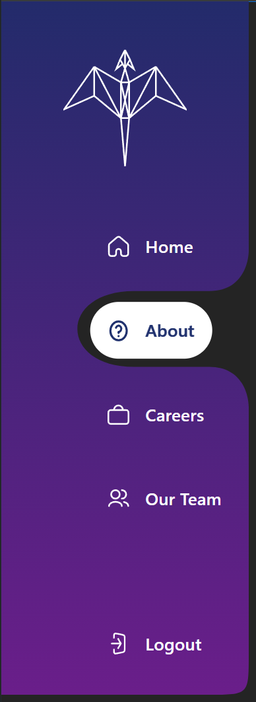

# Amphiptere CSS

A library for unique and visually engaging web components.

Current components:
- Liquid Navbar: A navbar featuring a smoothly morphing SVG that "parts" around your navitems



## Installation

Install via npm:

```bash
npm install amphiptere-css
```

## Usage

Import a component in your project (ESM):

```js
import 'amphiptere-css/dist/liquid-navbar.js';
```

Then use the custom element in your HTML:

```html
<liquid-navbar
  logo="/assets/amphiptere-css-logo.svg"
  items='[{"label":"Home","href":"/home","icon":"/assets/home.svg"}]'
  trailing='{"label":"Logout","href":"/logout","icon":"/assets/logout.svg"}'
  width="450"
  height="700"
  style="--navbar-background: linear-gradient(180deg, #232b6b 0%, #6a1e8a 100%); --nav-link-color: #fff;"
></liquid-navbar>
```

## Customization

You can customize the look and feel using CSS custom properties:

| Variable                   | Description                       | Example Value                        |
|----------------------------|-----------------------------------|--------------------------------------|
| --navbar-background        | Navbar background gradient/color  | `linear-gradient(...)`               |
| --nav-link-color           | Nav link text color               | `#fff`                               |
| --nav-link-font-size       | Nav link font size                | `1.1rem`                             |
| --nav-link-hover-filter    | Nav link hover filter             | `brightness(0) ...`                  |
| --nav-item-bg              | Nav item background color         | `#fff`                               |
| ...                        | ...                               | ...                                  |

## Storybook

Visit the live storybook demo page to view an interactive example 

## License

MIT